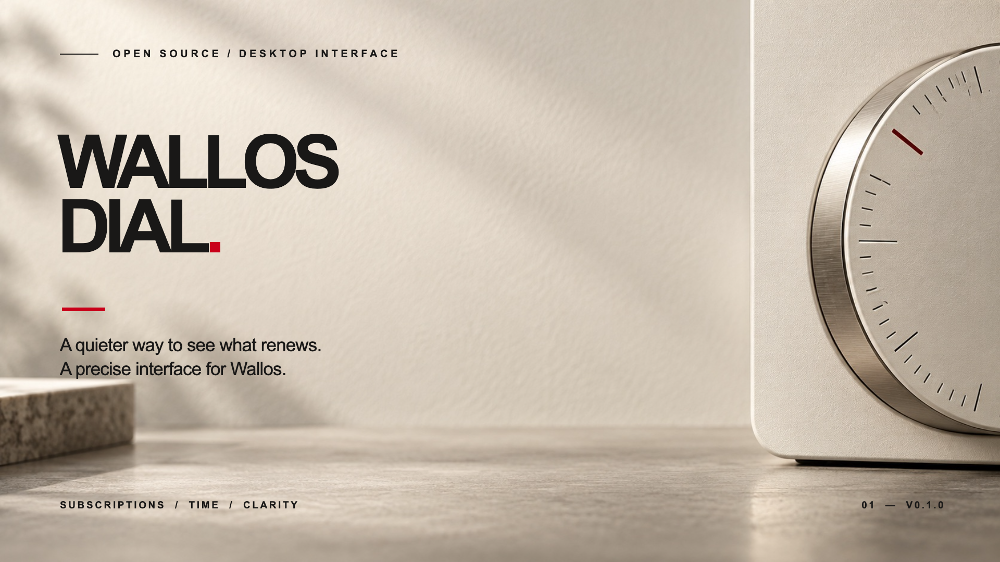
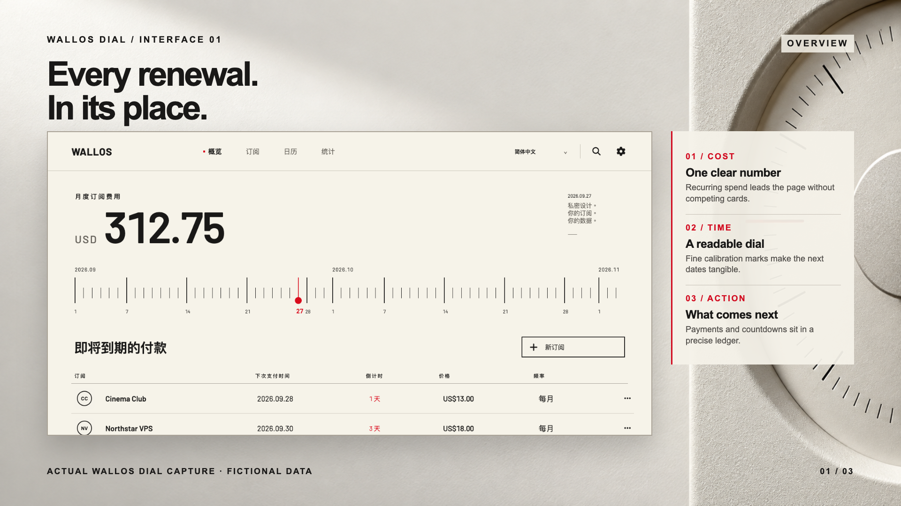
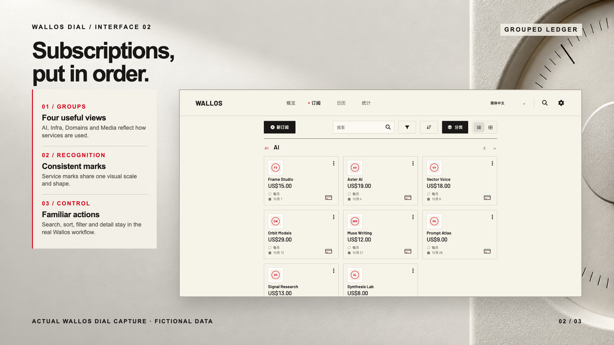
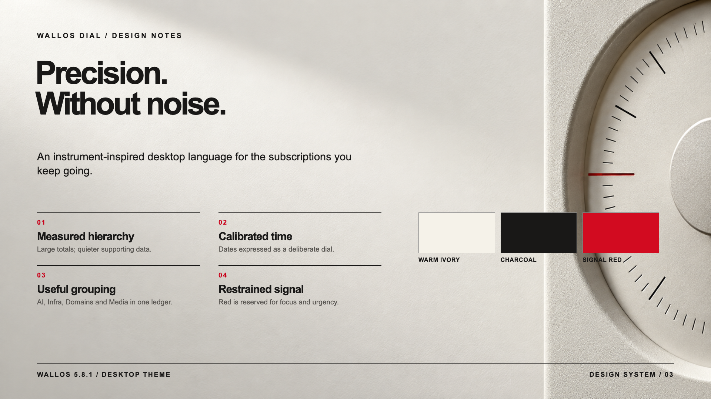
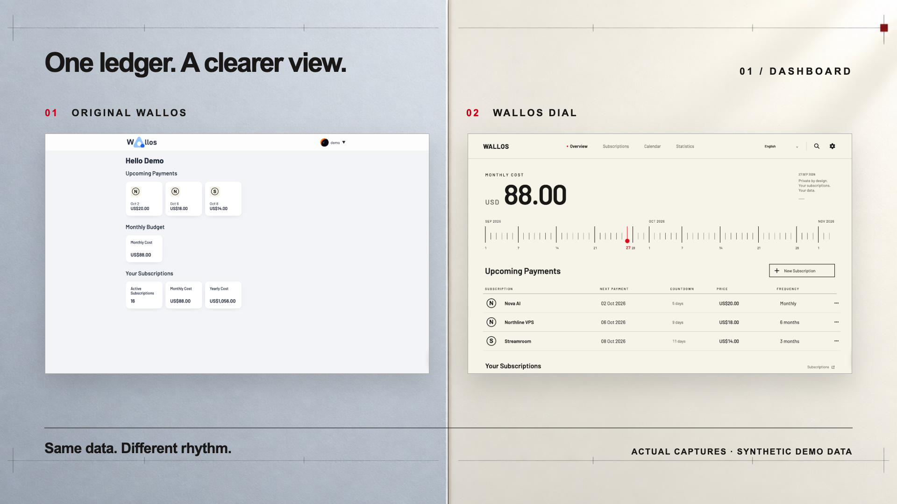

# Wallos Dial

[Try the interactive demo](https://lukevoidx.github.io/wallos-dial-theme/) · [English](README.md) · [简体中文](README.zh-CN.md) · [Before / after](docs/SHOWCASE.md) · [Install and upgrade](docs/UPGRADING.md)

A precise, warm, desktop-focused interface for [Wallos](https://github.com/ellite/Wallos). The theme adds an instrument-style dashboard timeline, a restrained type and color system, grouped subscription cards, clearer statistics, focused interaction states, and a persistent language switch in the header. Wallos's subscription, calendar, settings, search, and notification features remain available.

**Dial version:** `0.1.0` · **Tested Wallos version:** `5.8.1` only.

**Try it before installing:** [Open the live bilingual demo](https://lukevoidx.github.io/wallos-dial-theme/) (planned public URL). The GitHub Pages link forwards to an isolated Wallos Dial container running the actual PHP application with 30 fictional subscriptions. Browse the overview, grouped subscriptions, calendar, statistics, details, and language switch. The public environment is read-only; install the image to use account and editing functions. [How the live demo works](docs/DEMO.md).



The UI inside the showcase is a direct browser capture from an isolated demo account. All names, prices, and marks shown in this repository are synthetic. [Inspect the full-size interface capture](docs/assets/screenshots/real-demo-overview.png) or [see original Wallos and Dial side by side](docs/SHOWCASE.md).

Compatibility is published per Wallos version. An upstream release does not automatically make an older Dial image compatible. The build checks the exact upstream files it replaces and stops on a mismatch; a newly tested Dial image is then published.

Dial is a source overlay built into a Docker image. It is not a native Wallos theme option, and it is not affiliated with the Wallos project. Upgrading Wallos requires rebuilding and reviewing the overlay against the new upstream version. See [Updating](docs/UPGRADING.md).

**Recommended for:** someone self-hosting Wallos 5.8.1 who wants a quieter, desktop-first view and is willing to keep a versioned image. If your priority is a phone-first UI or automatically taking every new Wallos release, wait for a compatible release before switching. Keep a database backup either way.

## Preview

The design uses warm off-white, dark numerals, fine lines, and a small red signal. It is tuned for desktop use. The original Wallos mobile layout remains available, but this release does not promise a separate mobile redesign.





| What you see | What it helps with |
|---|---|
| Monthly total and precise date dial | Read the recurring commitment and its timing at a glance. |
| Upcoming-payment countdown | See calendar days until the next three payments. |
| Grouped subscription ledger | Scan AI, infrastructure, domains, media, or your own categories. |
| Unified calendar and statistics | Move between dates and costs without a change in visual language. |
| Quick language selector | Switch between English, Simplified Chinese, Traditional Chinese, and Wallos's other locales. |



[See the subscriptions comparison, other views, and full-resolution captures](docs/SHOWCASE.md).

## Install a new instance

Requirements: Docker with Compose, an available local port `8282`, and a recent browser.

```bash
git clone https://github.com/LukeVoidX/wallos-dial-theme.git
cd wallos-dial-theme
docker compose up -d
```

Open `http://127.0.0.1:8282` from the same machine. The Compose file pulls a prebuilt versioned image and binds to loopback; use your own HTTPS reverse proxy and access controls if you need remote access. Set `TZ` in a local `.env` file if needed. Wallos stores its database in `./data/db` and uploaded subscription logos in `./data/logos`; both are excluded from Git.

For a server you access by SSH, keep the loopback binding and forward the port: `ssh -L 8282:127.0.0.1:8282 user@your-server`. Then open `http://127.0.0.1:8282` locally. Complete Wallos's normal first-run registration there.

Verify the container with `docker compose ps` and `curl -fsS http://127.0.0.1:8282/health.php`. If startup or assets fail, see [Troubleshooting](docs/TROUBLESHOOTING.md).

Contributors can build the same source locally with `docker compose -f compose.build.yaml up -d --build`.

## Use an existing Wallos database

1. Back up the existing SQLite database and uploaded logos. Keep the previous image reference and Compose file for rollback.
2. Copy the repository locally and create a Git-ignored `.env` file with **absolute** paths to the existing mounted directories:

   ```dotenv
   WALLOS_DB_DIR=/absolute/path/to/current/db
   WALLOS_LOGOS_DIR=/absolute/path/to/current/logos
   TZ=Europe/Berlin
   ```

3. Run `docker compose config` and check the resolved mounts. Stop the old container before starting Dial on the same port; then run `docker compose up -d`.
4. Check login, subscription count, logos, dashboard, calendar, statistics, settings, and notifications. Do not re-enter subscriptions.

The theme itself does not seed or edit subscriptions. Wallos's own startup and migration behavior still applies; test a newer Wallos base against a disposable data copy first. If your existing service uses other environment variables, proxy rules, or a different port, carry them into your deployment configuration deliberately.

Do not mount a live database into a second running Wallos container. Stop the old container after backing up and validating your Dial Compose mounts.

## Optional custom vector logos

Uploaded logos remain untouched and are fitted into a consistent tile by default. For a custom SVG, put it in `config/icons/` and uncomment the two read-only mounts in `compose.yaml`. Copy [`config/logo-map.example.php`](config/logo-map.example.php) to `config/logo-map.local.php`, then map the uploaded filename to your SVG filename. Unknown filenames keep their original uploaded logo.

This repository contains no subscription data, uploaded logos, brand marks, or private logo mappings. `config/icons/`, `config/logo-map.local.php`, `.env`, and `data/` are Git ignored.

## Language switch

Use the selector in the shared header to switch quickly between 简体中文, English, and 繁體中文. The menu also includes all other Wallos languages. Dial saves the choice to the existing Wallos account language field and language cookie; it persists across pages and sign-ins. User-entered subscription and category names remain as entered.

## Updates and compatibility

| Dial | Tested Wallos | Install image |
|---|---|---|
| 0.1.0 | 5.8.1 | `ghcr.io/lukevoidx/wallos-dial:0.1.0` |

Use a versioned Dial image; avoid `latest`. A weekly workflow detects new upstream Wallos releases. Maintainers inspect changed templates, run the compatibility gate and smoke checks, then publish a new Dial image. Until that verified image exists, keep the previous working version. [Upgrade and rollback details](docs/UPGRADING.md).

## What is included

- `theme/`: modified Wallos PHP, CSS, and JavaScript files at their in-container paths.
- `compose.yaml`: pull-only, loopback-bound deployment with persistent database and logo volumes.
- `Dockerfile` and `compose.build.yaml`: source build for contributors and pre-release checks.
- `compat/upstream-files.sha256`: hashes of every upstream file overwritten by the theme; a changed base fails the build pending review.
- `VERSION` and `WALLOS_VERSION`: theme release and tested upstream version.
- `docs/UPGRADING.md`: compatibility and rollback instructions.
- `docs/SHOWCASE.md`: direct, synthetic-data screenshots and before/after posters.
- `docs/index.html`: GitHub Pages entry point forwarding to the isolated live demo.
- `demo/seed.py`: synthetic data and SVG logo generator for a fresh demo database.
- `docs/TROUBLESHOOTING.md`: startup, port, logo, cache, and compatibility checks.
- `README.zh-CN.md`: Simplified Chinese installation guide.
- `LICENSE.md`: GPLv3, matching the upstream project's license.

`./scripts/check-package.sh` validates the package. `docker build -t wallos-dial:0.1.0 .` and `./scripts/smoke-image.sh wallos-dial:0.1.0` check a local image. Releases publish both `linux/amd64` and `linux/arm64` images after passing these gates.

## Credits and license

Wallos Dial modifies [Wallos](https://github.com/ellite/Wallos), originally by ellite and contributors. Wallos and this derivative source are distributed under [GPLv3](LICENSE.md). Keep the upstream copyright and license notices when redistributing. No official Wallos endorsement is implied.

Suggestions and fixes are welcome. Read [Contributing](CONTRIBUTING.md) before proposing support for a new Wallos version. For bugs, include the Dial version, Wallos version, browser, and a redacted screenshot; never attach your database or credentials.
