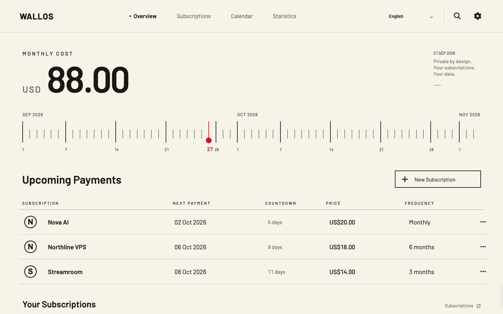

# Wallos Dial


[立即体验在线 Demo](https://lukevoidx.github.io/wallos-dial-theme/) · [English](README.md) · [改版前后与原始截图](docs/SHOWCASE.md) · [安装、升级和回退](docs/UPGRADING.md)

Wallos Dial 是为 [Wallos](https://github.com/ellite/Wallos) 设计的桌面界面改版。暖白底、黑色数字、细线和少量红色贯穿总览、订阅、日历与统计页面。首页集中显示月度费用、日期刻度、近期付款和倒计时；订阅页增加分类区块。原有搜索、筛选、排序、新增与编辑、通知和设置功能继续由 Wallos 处理。

**Dial 版本：**`0.1.0` · **已验证的 Wallos 版本：**仅 `5.8.1`。这是构建在固定 Wallos 镜像上的源码叠加层，并非 Wallos 内置的可切换主题；它不隶属于 Wallos 官方。

**先体验，再安装：**[打开免费的中英文交互 Demo](https://lukevoidx.github.io/wallos-dial-theme/)。内含 30 条虚构订阅，可以操作总览、分类订阅、日历、统计、搜索、编辑和语言切换。修改仅保存在当前浏览器。这个 GitHub Pages 页面是静态预览，不连接 Wallos 服务器，也不处理付款。[了解 Demo 的边界与重置方法](docs/DEMO.md)。



仓库中的界面截图来自隔离示例账号，名称、金额和图标均为虚构。ImageGen 只用于海报背景，前后对比中的界面保持真实浏览器截图。[查看完整对比](docs/SHOWCASE.md)。

## 新安装

需要 Docker、Compose，以及本机空闲的 `8282` 端口：

```bash
git clone https://github.com/LukeVoidX/wallos-dial-theme.git
cd wallos-dial-theme
docker compose up -d
docker compose ps
```

在运行 Docker 的机器上打开 `http://127.0.0.1:8282`，按 Wallos 原有流程注册。默认只监听 `127.0.0.1`；如果 Docker 在远程服务器，可通过 SSH 转发访问：

```bash
ssh -L 8282:127.0.0.1:8282 user@your-server
```

随后在自己的电脑打开 `http://127.0.0.1:8282`。需要公开访问时，请自行配置 HTTPS 反向代理和访问控制。数据库和上传的 Logo 分别保存在 `./data/db` 与 `./data/logos`，不会提交进 Git。时区可在本地 `.env` 中设置 `TZ=Asia/Taipei` 等有效值。

用 `curl -fsS http://127.0.0.1:8282/health.php` 检查服务。遇到端口、权限、Logo 或缓存问题，先看[故障排查](docs/TROUBLESHOOTING.md)。

## 使用现有 Wallos 数据

1. 先用 SQLite 的 `.backup` 备份现有 `wallos.db`，并单独备份上传的 Logo、当前 Compose 文件和镜像版本。
2. 在仓库目录建立不提交到 Git 的 `.env`，写入现有目录的**绝对路径**：

   ```dotenv
   WALLOS_DB_DIR=/absolute/path/to/current/db
   WALLOS_LOGOS_DIR=/absolute/path/to/current/logos
   TZ=Asia/Taipei
   ```

3. 运行 `docker compose config`，核对解析出的挂载目录。停止旧 Wallos 容器后，再运行 `docker compose up -d`；不要让两个容器同时写同一数据库。
4. 登录后核对订阅数量、Logo、总览、日历、统计、设置和通知。无需重新录入订阅。

如果原部署还有额外环境变量、代理或自定义端口，应按实际情况带入新部署。[升级与回退说明](docs/UPGRADING.md)包含版本切换和数据库迁移边界。

## 自定义 Logo 与语言

已有上传 Logo 会保留。若希望个别服务使用自备 SVG，可以将文件放入 `config/icons/`，从 [`config/logo-map.example.php`](config/logo-map.example.php) 复制一份 `config/logo-map.local.php`，建立上传文件名到 SVG 文件名的映射，再启用 `compose.yaml` 中的只读挂载。仓库不包含用户的品牌素材或私人映射。

顶栏提供简体中文、English、繁體中文的快捷选项，也保留 Wallos 其他语言。选择会保存到现有账户语言字段和 Cookie；用户自己录入的订阅名称不会自动翻译。

## 更新边界

Dial `0.1.0` 固定在 Wallos `5.8.1`。Wallos 发布新版本后，本主题**不会自动跳到未经验证的上游版本**。维护者需检查被替换文件的差异，更新适配，测试数据副本，然后发布新的 Dial 镜像。现有版本可以继续运行；不要直接把 Dockerfile 的 Wallos 版本号改新就上线。详见[升级和回退](docs/UPGRADING.md)。

此版本重点是桌面体验，没有单独承诺手机重新设计，也不承诺未来每次 Wallos 更新都零故障。

## 项目与许可

- [英文完整说明](README.md)
- [改版展示与原始截图](docs/SHOWCASE.md)
- [故障排查](docs/TROUBLESHOOTING.md)
- [贡献指南](CONTRIBUTING.md)

Wallos Dial 基于 Wallos 改作，沿用 [GPLv3](LICENSE.md)，保留上游归属；不代表 Wallos 官方认可。
