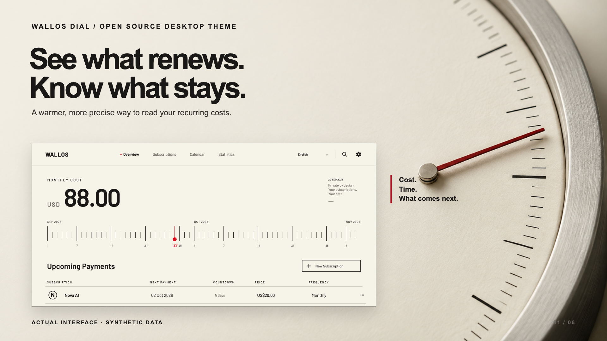
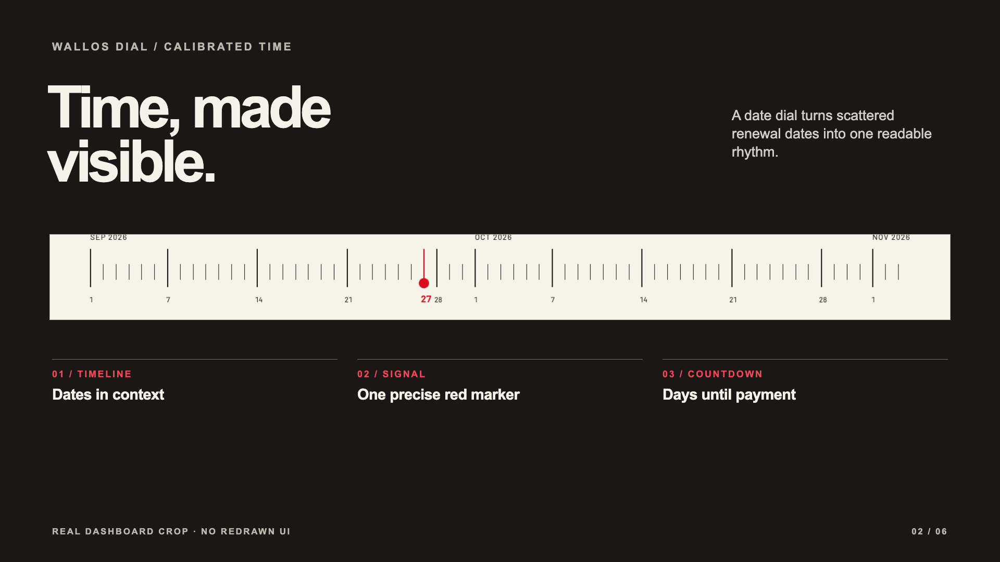
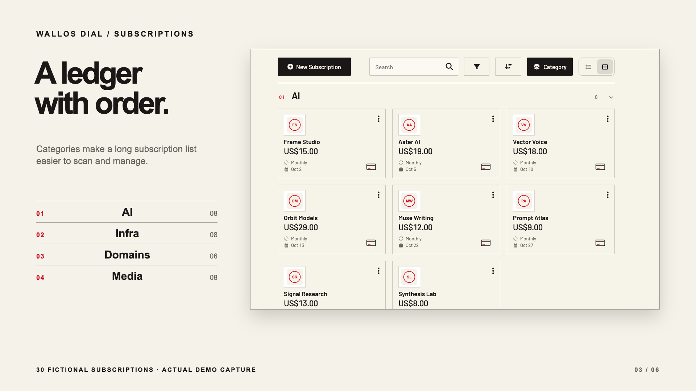
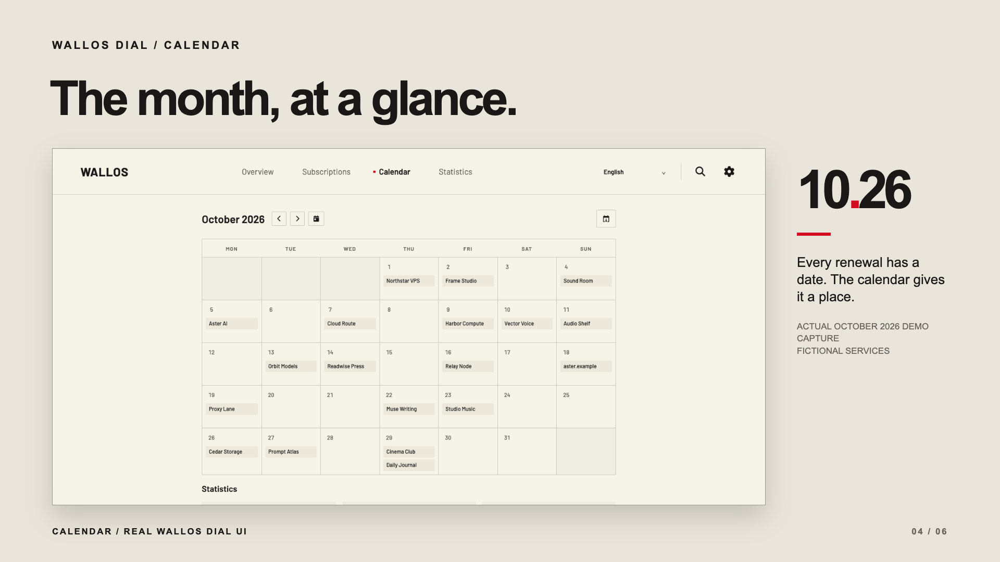
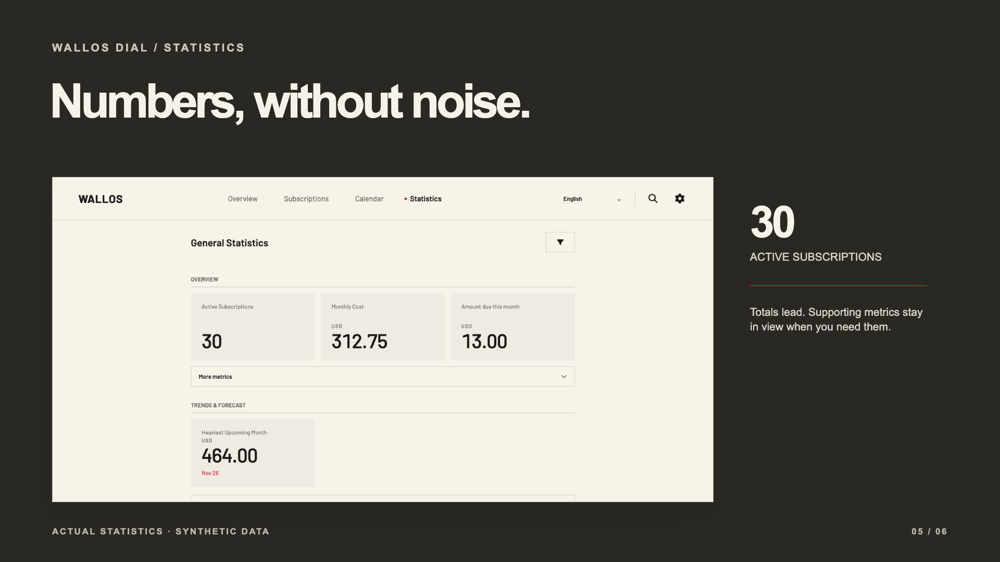
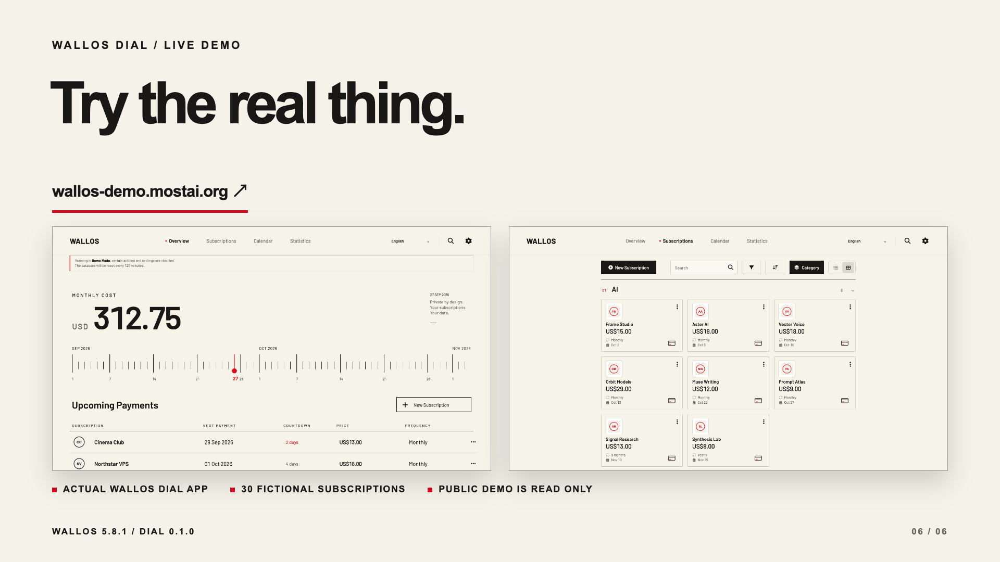

# Wallos Dial poster series

**English** · [简体中文](CAMPAIGN.zh-CN.md)

Six posters show one feature at a time. Every application panel is a direct capture of Wallos Dial running with fictional subscriptions. ImageGen created only the instrument photograph behind the hero; headlines, labels and layout are typeset in [`campaign.html`](assets/posters/source/campaign.html).

## 01 · Overview

## 02 · Date dial and countdown

## 03 · Grouped subscription ledger

## 04 · Calendar

## 05 · Statistics

## 06 · Live demo

## Design references and limits

- [Actual Budget](https://actualbudget.org/) leads with a clear product purpose, real application views and a direct demo link. We use the same clarity of sequence, with Wallos Dial's own visual language.
- [Paperless-ngx](https://docs.paperless-ngx.com/usage/) documents real workflow screens. Our feature posters likewise use browser captures rather than invented interface details.
- [Immich UI](https://ui.immich.app/introduction) describes a shared visual system across product surfaces. This series keeps one restrained palette and typographic scale while varying composition by feature.
- [Penpot](https://penpot.app/) pairs product views with a specific capability. Each poster here focuses on one Wallos Dial feature.

These references informed the presentation approach; no artwork, UI or wording was copied from those projects. The English hero and date dial use the 16-record review fixture. Grouped subscriptions, October calendar, statistics and live-demo panels use the separate 30-record public demo fixture. All service names, prices, marks and dates are synthetic. Posters show desktop layouts. The public demo is read-only. Wallos Dial 0.1.0 is tested only with Wallos 5.8.1.

[View the Simplified Chinese posters and notes →](CAMPAIGN.zh-CN.md)
