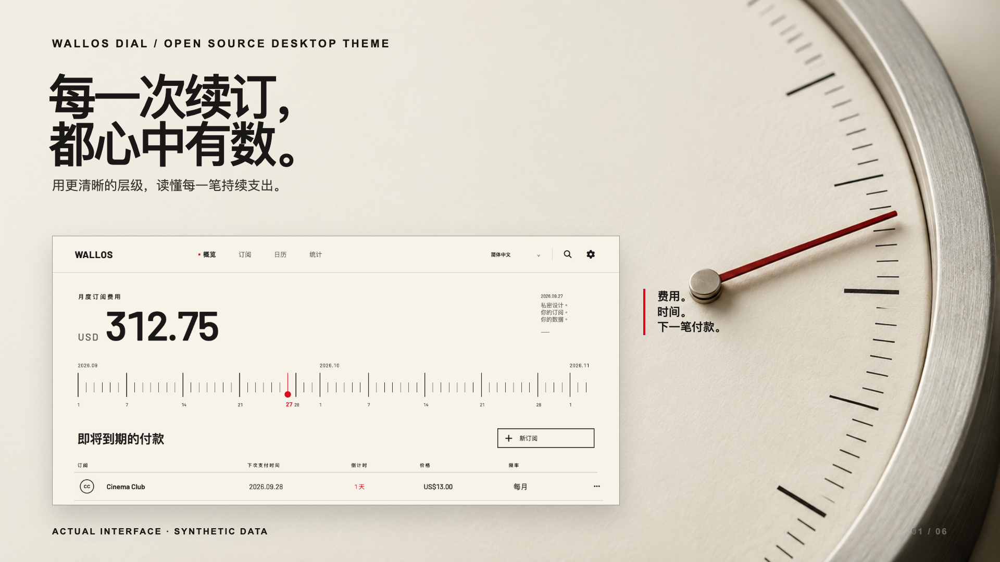
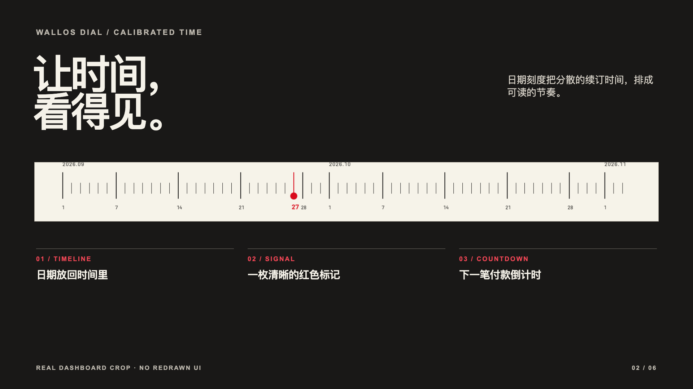
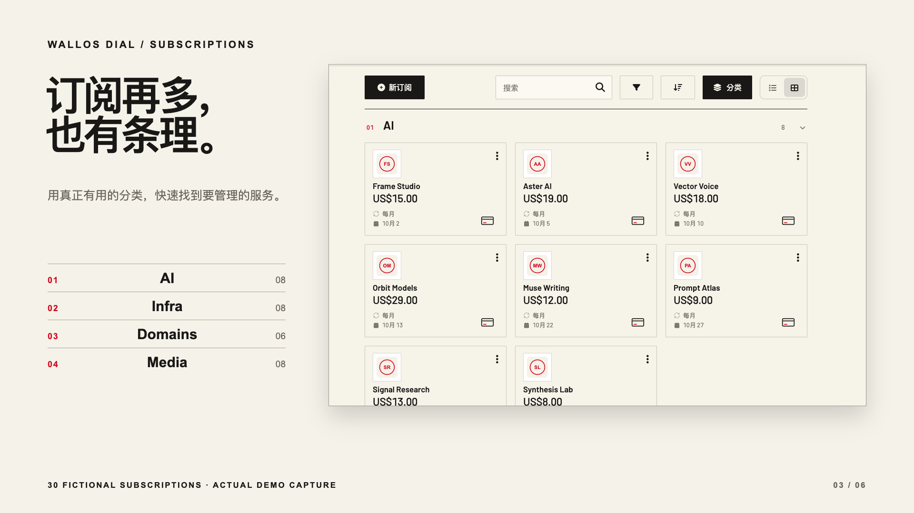
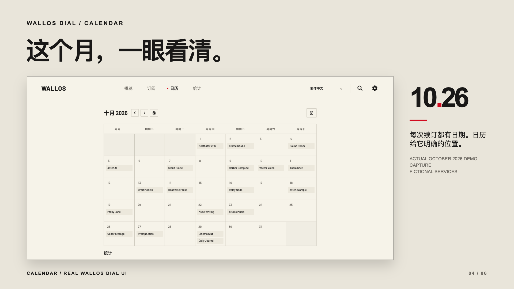
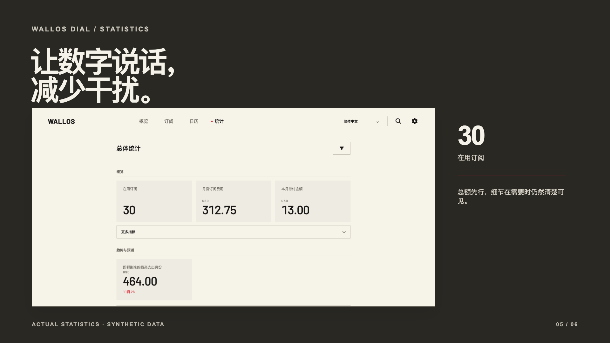
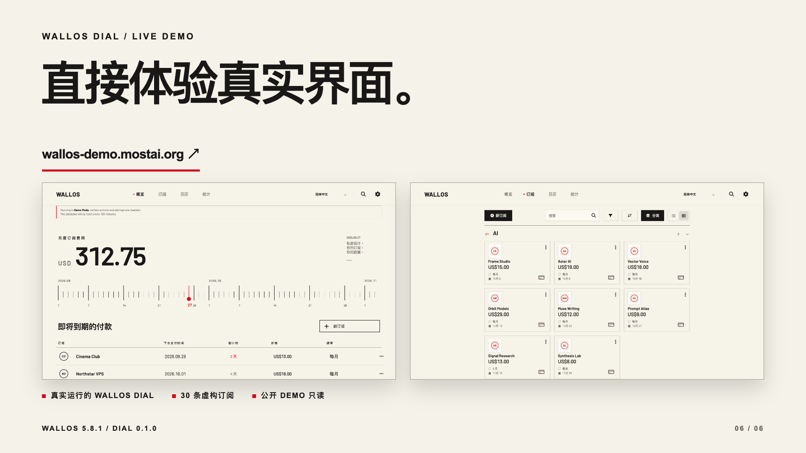

# Wallos Dial 主题海报

[English](CAMPAIGN.md) · **简体中文**

六张海报分别介绍一个功能。每张图中的软件画面，都直接截取自使用虚构订阅数据运行的 Wallos Dial。ImageGen 只生成主视觉背后的仪器照片；标题、标注与版式均在 [`campaign.html`](assets/posters/source/campaign.html) 中排版。

## 01 · 总览

## 02 · 日期刻度与倒计时

## 03 · 分类订阅

## 04 · 日历

## 05 · 统计

## 06 · 在线体验

## 设计参考与使用边界

- [Actual Budget](https://actualbudget.org/) 用清楚的产品定位、真实界面和 Demo 入口引导读者。我们借鉴这种展示顺序，并保持 Wallos Dial 自己的视觉语言。
- [Paperless-ngx](https://docs.paperless-ngx.com/usage/) 用实际操作画面解释功能。这组海报同样保留真实浏览器截图。
- [Immich UI](https://ui.immich.app/introduction) 强调不同产品页面共享同一视觉系统。我们让颜色和字体层级保持一致，同时按功能调整每张海报的构图。
- [Penpot](https://penpot.app/) 将产品画面与具体能力对应。这里每张海报也只聚焦 Wallos Dial 的一个特点。

参考的是展示方法，没有复制这些项目的图片、界面或文案。中文主视觉与日期刻度使用 30 条虚构订阅的 Demo 截图；分类订阅、十月日历、统计和在线体验也使用该独立公开 Demo 的数据。服务名称、价格、标识与日期均为虚构。海报展示桌面布局；公开 Demo 只读。Wallos Dial 0.1.0 目前仅验证 Wallos 5.8.1。

[View the English posters and notes →](CAMPAIGN.md)
