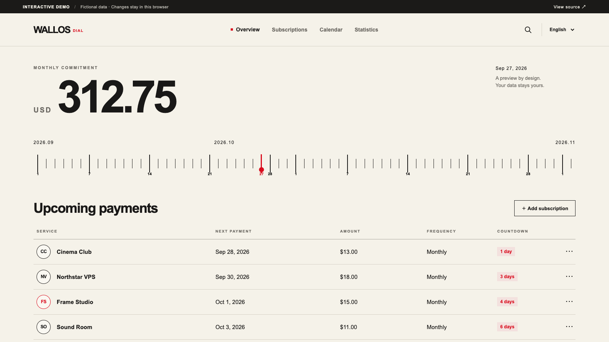

# Interactive demo / 交互演示

**Demo URL after publication:** https://lukevoidx.github.io/wallos-dial-theme/



[See the grouped subscription view](assets/screenshots/pages-demo-subscriptions.png). These captures show the static Pages demo; the [actual Wallos theme captures](SHOWCASE.md) are separate.

## English

The GitHub Pages demo is a static, representative interface preview. It starts with 30 fictional subscriptions in four groups: AI, Infra, Domains, and Media. Try the date dial, search and filters, sorting, list/grid views, details, add/edit/delete, calendar, statistics, and English/Simplified Chinese selector. An edit is saved to this browser's `localStorage`; **Reset demo data** restores the fictional starter records. There is no login, real billing, Wallos PHP backend, remote database, or connection to the maintainer's private server. Service names, amounts, and marks are synthetic. The real Wallos features require the [versioned Docker installation](../README.md#install-a-new-instance).

To preview locally:

```bash
python3 -m http.server 4190 --directory docs
```

Then open `http://127.0.0.1:4190/`. The demo uses relative asset paths so it also works under the GitHub Pages project prefix.

To publish: create the public repository, then in **Settings → Pages → Build and deployment**, select **Deploy from a branch**, branch `main`, folder `/docs`. The root file is `docs/index.html`; `docs/.nojekyll` keeps the site static. Wait for the Pages deployment to report success and verify the public URL in an anonymous browser session. A Pages preview becoming reachable does not verify the Docker image, GHCR package, or Wallos compatibility.

## 简体中文

GitHub Pages Demo 是静态界面预览，预置 30 条虚构订阅，分为 AI、Infra、Domains、Media 四组。可以试用日期刻度、搜索与筛选、排序、列表/网格、详情、新增/编辑/删除、日历、统计和中英文切换。修改仅写入当前浏览器的 `localStorage`；点击「重置演示数据」即可恢复初始记录。这里没有登录、真实扣款、Wallos PHP 后端、远程数据库，也不会连接维护者的私人服务器。名称、金额和标识均为虚构。完整 Wallos 功能需要按[安装说明](../README.zh-CN.md#新安装)部署固定版本 Docker 镜像。

本地预览运行上面的命令，打开 `http://127.0.0.1:4190/`。正式发布时，在仓库 **Settings → Pages → Build and deployment** 选择 **Deploy from a branch**、`main` 和 `/docs`，待部署成功后用未登录的浏览器验证公开网址。Demo 上线不能代替 Docker 安装与兼容性验证。
