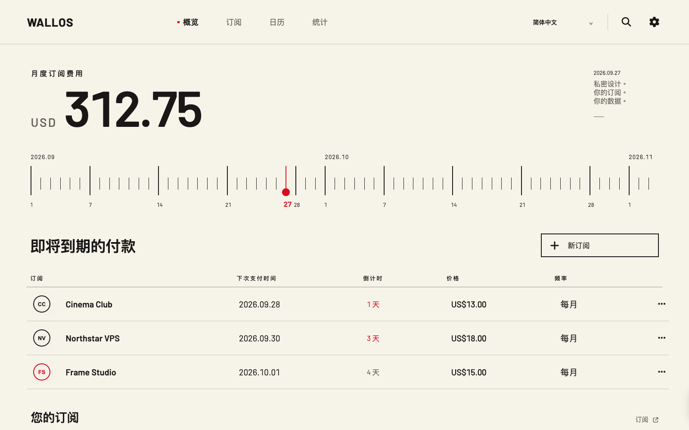

# Live demo / 真实演示

**Local running preview:** `http://127.0.0.1:4190/` (available while the maintainer's local demo container is running).

**Planned public entry:** `https://lukevoidx.github.io/wallos-dial-theme/` → `https://wallos-demo.jarvishub.me/`. Neither URL is a published-demo claim until both endpoints pass anonymous verification.

[See the real grouped subscription page](assets/screenshots/real-demo-subscriptions.png). These are direct browser captures of the Wallos Dial Docker image with synthetic records, not a separately recreated interface.

## English

The live demo runs the same Wallos Dial PHP/CSS/JavaScript image as the installable release, pinned to Wallos 5.8.1. It uses a separate SQLite volume with one fictional account, 30 fictional subscriptions in AI, Infra, Domains, and Media, and generated SVG marks. No maintainer account, private subscription, uploaded logo, API key, or production database is mounted. The public runtime is read-only at the reverse proxy; browsing, search, date dial, details, calendar, statistics, and per-visitor language choice remain available. Add/edit/delete, account settings, exports, notifications, and administration require a personal installation. The public dataset is periodically restored from the synthetic seed.

GitHub Pages can host the free **entry URL**, but it cannot run Wallos's PHP/SQLite backend. `docs/index.html` forwards to the isolated container on the maintainer's server. Keeping the app on a separate hostname and volume also prevents visitors from reaching the private Wallos service.

`demo/seed.py` initializes **only a fresh, migrated database** and refuses to touch one containing any user or subscription. Run it with paths to an isolated SQLite database and uploaded-logo directory. The local preview is bound to loopback on port 4190. Do not reuse a real database or mount the private service's logo directory.

## 简体中文

真实 Demo 运行与安装包相同的 Wallos Dial PHP/CSS/JavaScript 镜像，固定在 Wallos 5.8.1。它有独立的 SQLite 数据卷、一个虚构账户、30 条虚构订阅，以及自动生成的 SVG 标识；不会挂载维护者的账户、私人订阅、上传 Logo、API 密钥或生产数据库。公开访问由反向代理限制为只读：总览、搜索、日期刻度、详情、日历、统计和每位访客独立的语言选择可以体验；新增/编辑/删除、账户设置、导出、通知及管理功能需要自行安装。虚构数据会定期恢复。

GitHub Pages 提供免费的**入口网址**，但不能执行 Wallos 的 PHP/SQLite 后端。`docs/index.html` 会跳转到服务器上隔离运行的 Demo 容器。它使用独立主机名和数据卷，与私人 Wallos 服务隔开。

`demo/seed.py` 只允许初始化**没有用户和订阅的已迁移数据库**，发现已有数据会拒绝运行。本地预览仅绑定 `127.0.0.1:4190`。切勿将私人 Wallos 数据库或上传目录用于 Demo。
