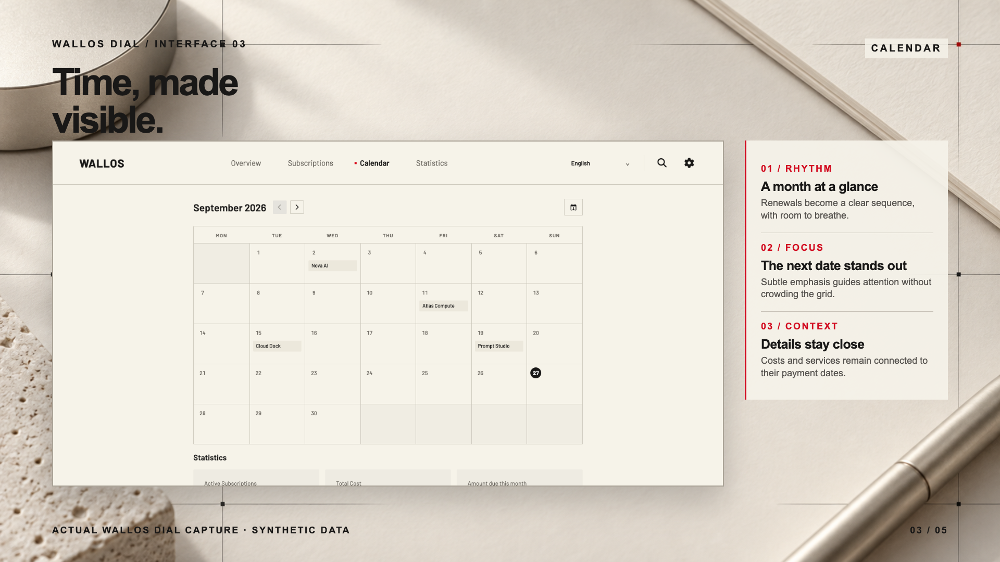
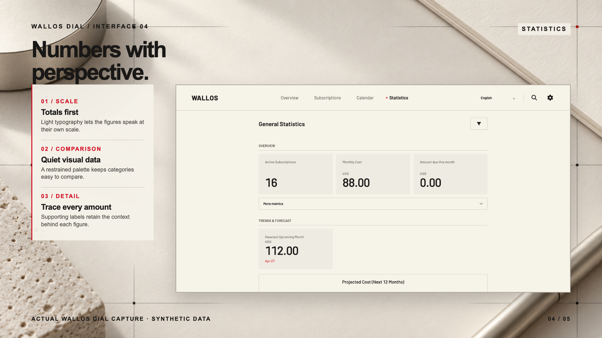
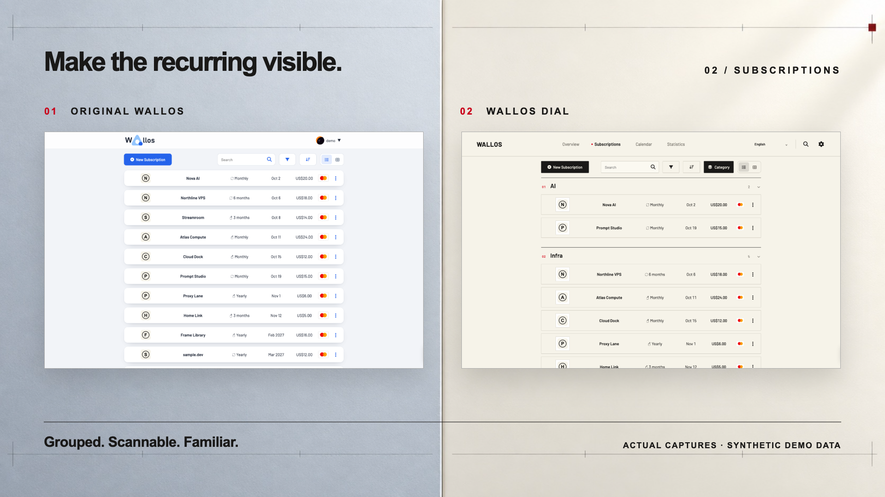
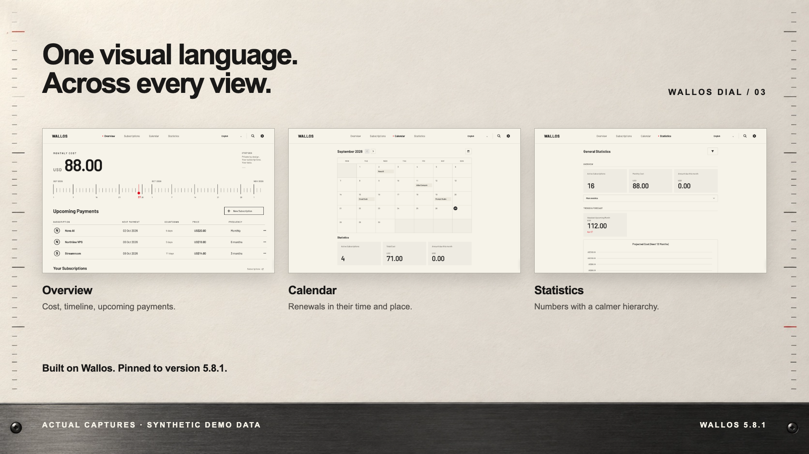

# Wallos Dial showcase

[Browse the six-part poster series in English](CAMPAIGN.md) · [查看六张中文主题海报](CAMPAIGN.zh-CN.md)

The UI in these comparisons is captured directly from Wallos 5.8.1 and Wallos Dial 0.1.0 running with **the same synthetic demo database**. Service names, prices, user, logos, and payment method are fictitious. ImageGen was used for the editorial backgrounds; it did not redraw the UI screenshots.

## Design direction and product showcase

The warm ivory surface, dark figures, precise date marks and small red accents define the system. The generated background suggests an instrument dial; the poster copy and palette are typeset separately.

The overview and subscription showcases use [actual demo overview](assets/screenshots/real-demo-overview.png) and [grouped grid](assets/screenshots/real-demo-grid.png) captures from the 30-record fictional demo. The calendar and statistics posters use [calendar](assets/screenshots/after-calendar.png) and [statistics](assets/screenshots/after-stats.png) captures from the 16-record synthetic review fixture. Interface details were not redrawn.

## Overview

Full-resolution captures: [original Wallos](assets/screenshots/before-dashboard.png) · [Wallos Dial](assets/screenshots/after-dashboard.png)

Dial puts monthly cost, the date timeline, upcoming payments, and days remaining on one screen. The source Wallos page used the same subscription records.

## Subscriptions

Full-resolution captures: [original Wallos](assets/screenshots/before-subscriptions.png) · [Wallos Dial](assets/screenshots/after-subscriptions.png)

Dial groups subscriptions into categories while retaining search, filters, sorting, list/grid views, and subscription actions.

## Other views

Full-resolution captures: [calendar](assets/screenshots/after-calendar.png) · [statistics](assets/screenshots/after-stats.png)

These are presentation images, not a promise of identical appearance on every screen size. Dial is designed primarily for desktop. The screenshots were captured at a 1600×1000 CSS viewport on 2026-09-27. No personal subscription records or private logos are included.
